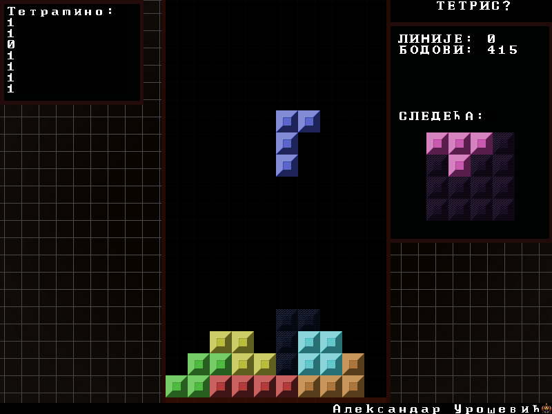
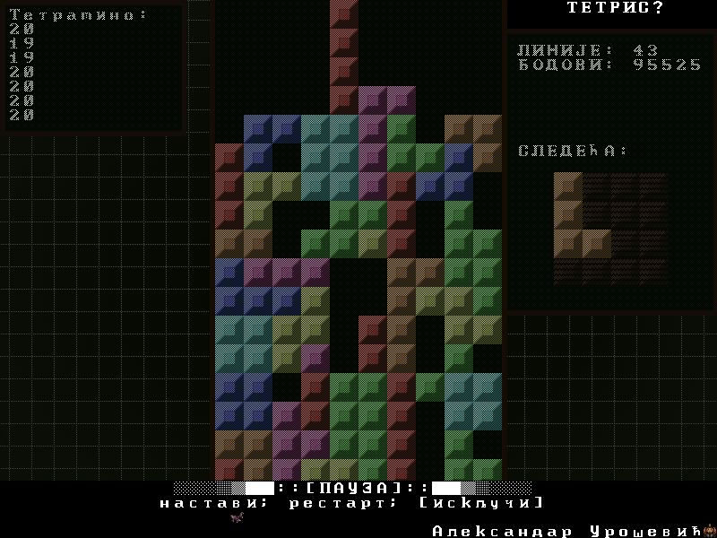
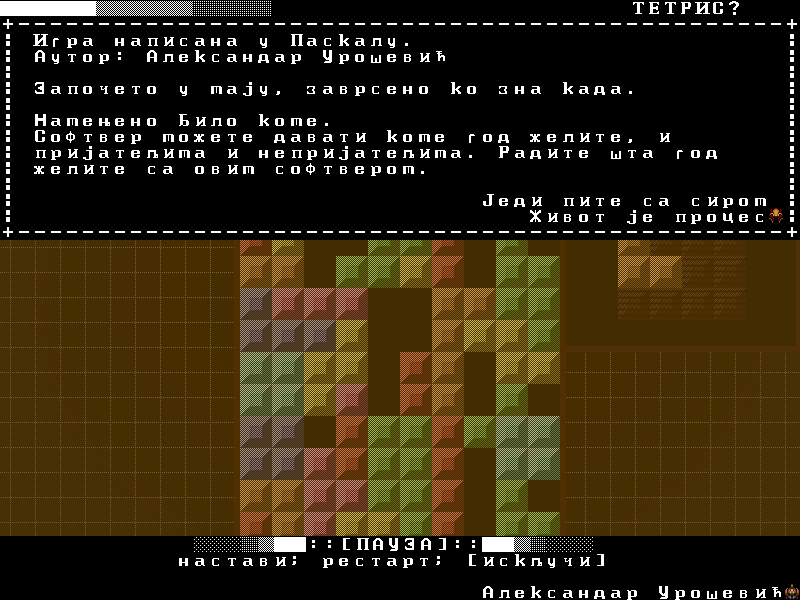

# Pastet

Tetris game written in Pascal

## Information

The software itself was written for a school project.

It was written sometime around mid 2017.

The software is not translated into English, it is only available in Serbian.

The software is built with [Lazarus IDE](https://www.lazarus-ide.org/), hence the Lazarus project files.

### Features

* Pause menu
* Colourful board
* Instant piece dropping
* Faster piece dropping
* Text rendering from an image
* Tetromino "sack"

### Text rendering

The text rendering subroutine `TTauGameMain.Ren_Text` is located in
[tau_game_main.pas](tau_game_main.pas#L169).

The procedure for drawing text is simple:

1. if the read character is `'$'`, draw the special character according to the
next character in the given string.
2. else draw the read character.

The font image is stored in `data/tex/char/0.png` and it contains not only 
characters but also small images.

### Tetromino "sack"

To mitigate the randomness of Tetris, we introduce tetromino sacks.
A sack guarantees that the player will get all 7 different tetrominoes during
7 turns. This way the player will not feel cheated, since the player knows the 
I, straight tetromino, shape will come to him soon enough.

After all tetrominoes from sack are used, new tetrominoes are put into the sack.


## Controls

```
Pause/Break - Pause the game
F1          - Show/hide the info screen
Spacebar    - Instant piece dropc
Down arrow  - Drop the piece faster
Left arrow  - Move the piece left/move the pause menu selection
Right arrow - Move the piece right/move the pause menu selection
z           - Rotate the piece counter-clockwise
x           - Rotate the piece clockwise
```

## Screenshots






